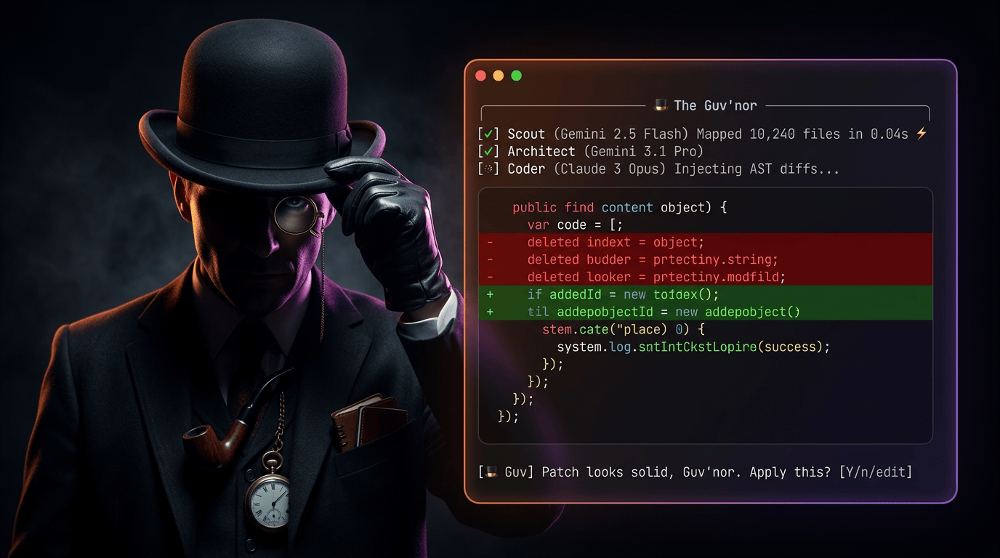

# 🎩 GuvCode

[](https://rust-lang.org)
[](LICENSE)

<p align="center">
  
</p>

**"Right away, Guv'nor."**

AI coding agent for your terminal. Single Rust binary. Multi-model. BYOK.

```bash
curl -sL https://guv.dev/install.sh | bash
guv auth --gemini "AIZA..." --anthropic "sk-ant..."
guv "Refactor auth middleware to use JWTs."
```

## Why

- **Fast** — single static binary, starts in 1ms, indexes 10k+ files in milliseconds via parallel `ripgrep`-style walking
- **Multi-model routing** — delegates tasks to the right model (Gemini for context, Claude for code, local Ollama for review)
- **AST-aware edits** — `tree-sitter` bindings for surgical code injection, no broken indentation
- **Git-safe** — auto-commits before edits, `guv undo` to revert instantly
- **Budgeted** — built-in token budgeting so you don't burn cash on runaway loops
- **BYOK** — bring your own keys, no vendor lock-in

## Models

GuvCode routes tasks to specialized models automatically:

| Role | Default Model | Job |
|---|---|---|
| **Scout** | Gemini 2.5 Pro/Flash | Ingest codebase, find relevant files |
| **Architect** | Gemini 3.1 Pro | Plan multi-file edits |
| **Coder** | Claude 3 Opus / Sonnet | Generate AST-aware diffs |
| **Reviewer** | Local Ollama / GPT-4o-mini | Validate syntax post-edit |

See [MODELS.md](./MODELS.md) for details.

## CLI

```bash
guv "Add error handling to the database layer"   # start coding
guv auth --gemini "KEY" --anthropic "KEY"         # configure keys
guv budget --limit 5.00                           # set spend cap
guv budget                                        # check spend
guv undo                                          # revert last edit
```

## Web Dashboard

Account management, API keys, and usage tracking. Not a code editor.

```bash
cd web && bun install && bun run dev   # → http://localhost:3000
```

See [`web/README.md`](./web/README.md) for details.

## Structure

```
src/                  Rust CLI
├── main.rs           CLI entrypoint (clap)
├── llm.rs            LLM providers & streaming
├── orchestrator.rs   Multi-agent orchestration
├── index.rs          Fast-resume codebase indexer
├── config.rs         TOML config & key management
├── git.rs            Auto-commit & undo
├── agent_logic/      Scout, Architect, Coder, Reviewer
└── ui/               TUI (ratatui)
web/                  Next.js dashboard
```

## Contributing

See [CONTRIBUTING.md](./CONTRIBUTING.md).
